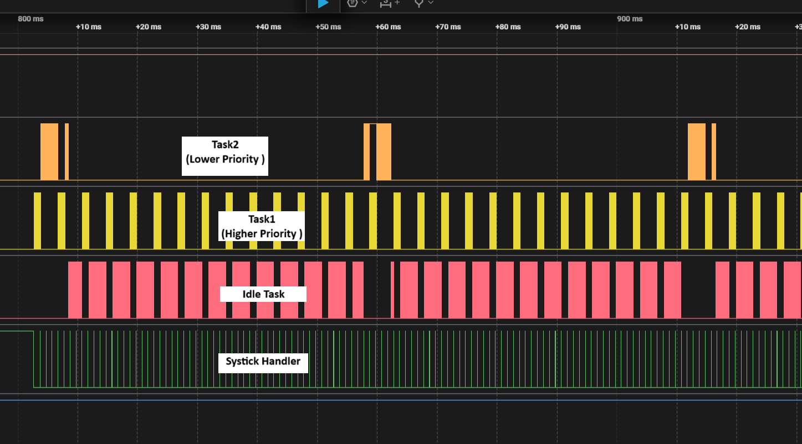
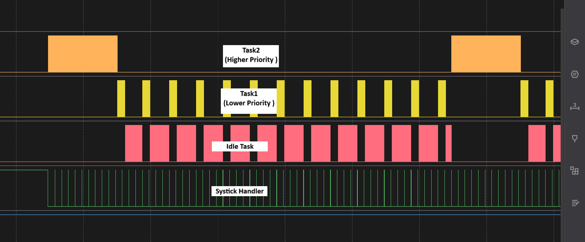

# Priority based RTOS Kernal
A preemptive priority-based scheduler, so all high-priority threads meet their hard-time requirements

## Important points
- When an exception occur in an ARM cortex-M processor, the processor automatically save certain registers to the stack as part of exception entry sequence. these registers are ( R0-R3 , R12 , LR , PC, xPSR ) and the HW also restore those registers as part of exception exit sequence
- I used PendSV Handler for context switching, PendSV Handler responsible for the following actions
    * Push R4-R11 on the stack for previous task
    * Make SP points to next task stack
    * Pop R4-R11 on the stack for next task
    * Jump to LR of next Task
- Benefits from Tail Chaining Mechanism between Systick and PendSV Handlers

## Context Switching 
- HW save 8 registers of task 1 
- PendSV (OS) save the other 8 registers of task 1
- PendSV (OS) restore the other 8 registers of task 2
- HW restore 8 registers of task 2 
## Screenshots 

